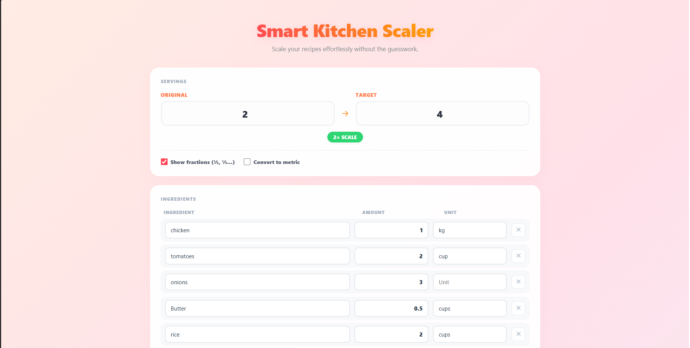
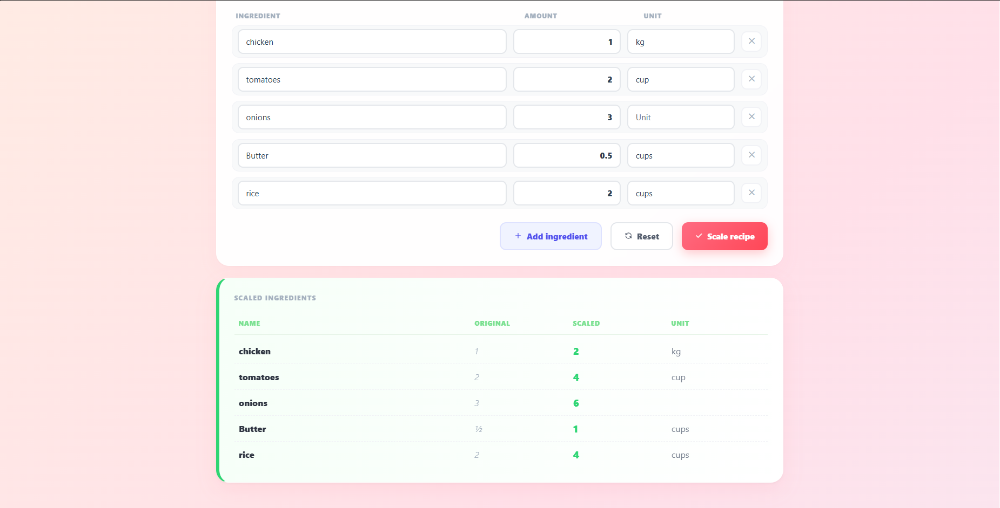

# 🍳 Smart Kitchen Scaler

An energetic, responsive web application designed to help chefs and bakers instantly scale recipe ingredient quantities without the mathematical guesswork. Built with a vibrant, playful user interface featuring smooth transitions and a dynamic citrus color palette.

## ✨ Features

- **Linear Scaling Engine:** Computes exact ingredient multipliers instantly based on original vs. target serving ratios.
- **Dynamic Element Injection:** Appends new ingredient fields on the fly via clean DOM manipulation.
- **Visual Feedback Metrics:** Displays active multiplier badges showing the exact directional scale shift.
- **Responsive Micro-interactions:** Fluid hover transformations and focus animations optimized for both desktop viewports and mobile screens.

## 📸 Interface Preview

## 🛠️ Built With

- **HTML5:** Semantic workspace layout blocks.
- **CSS3:** Custom grid architectures, modern UI glassmorphic cards, and smooth `@keyframes` background gradients.
- **Vanilla JavaScript:** Event-driven element generation and math interpolation.

